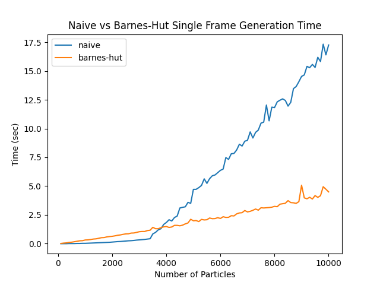

# NBody

## Abstract

One of the areas in which our mathematical analytical tools are lacking is in predicting the gravitational interaction between three or more bodies. Although a closed form solution for the motion caused by gravitational interactions exists for two-body systems and for certain initial conditions of three body systems, there doesn't exist a general solution for any number of interacting bodies. Simulations are used to approximate the motion of gravitating bodies, but maintaining accuracy is difficult due to their chaotic nature. NBody is a python package that aims to efficiently and accurately simulate the motion of particles affected by gravitational forces while also being easy to use and accessible. 

## Background Information

Being able to understand and predict the motion of large bodies such as stars, planets, and moons are essential for astronomical research. However, effeciently and accurately predicting their motion has proven to be a mathematical challenge. Closed-form solutions have been argued to be impossible, since for every n-body system, there exist more unknown variables than equations to describe them. Because of this, we are forced to find methods to approximate the motion of these bodies.

One of the biggest issues with this problem is the fact that gravitational systems are chaotic, meaning that small variations in the initial conditions of a system can result in a large range of potential outcomes. This also means that small errors in simulations will quickly add up over time, resulting in innacurate results. This is an intrinsic characteristic of this problem, and there is no clear solution to this other than trying to maximize the accuracy of simulations for as long as possible. 

One way to maintain accuracy when approximating gravitational interactions is to calculate the gravitational forces exerted by all bodies over very small time steps. Decreasing the amount of time in between simulation updates results in a higher accuracy, but takes longer to generate. For a large number of particles, measuring all the interacting forces between all of the particles is expensive. This is where further approximations, such as the Barnes-Hut method, come in. The Barnes-Hut method uses a quad tree that recursively divides particles up into their own cells, allowing nearby particles to be grouped together. Clusters of particles far away are approximated as a single mass at their center, allowing certain force calculations to be skipped entirely.  This allows for far more efficient simulations, at the cost of accuracy.

But how do we quantify this inaccuracy? Since there aren't analytic solutions to the motion of interacting particles, the simplest way to verify results is to measure the total energy of the system over time. Realistically, the energy should remain constant as long as there are no external forces acting on any particle. Although a constant energy doesn't guarantee that the results are correct, it can still be used as an indicator of accuracy since the lack of a constant energy shows that the simulation is unrealistic.

This python package was created with the purpose of being an easy-to-use tool to simulate gravitational interactions. It has a built-in CLI that allows one to visualize the evolution of a gravitational system, and can be easily imported and combined with any other python project. 

## Algorithm Comparison

The figure below shows the time it takes to generate a single frame using both the barnes-hut tree and naive simulation methods. For a small number of particles, the barnes-hut method is slower due to the initial time it takes to create the quadtree. But, with a larger number of particles (more than ~4000 based on this graph), the barnes-hut tree generates frames much faster due to the fact that it is performing less calculations.




## Features

- Naive but accurate O(n^2) approach to calculating forces on all particles and updating position
- Barnes-Hut approximation O(n log n) which handles larger scales more efficiently at the cost of accuracy
- Optional elastic collisions between particles
- 2D/3D visualization tool that also contains an energy plot to evaluate accuracy
- Command Line Interface


## Installation

NBody can be installed with either pip (the python package manager)

```bash
$ pip install nbody
```

OR through cloning the repository

```bash
$ git clone https://codeberg.org/uzairn/nbody
```

## Usage

The command line tool can be accessed by running 
```bash
$ python3 main.py
```

There are two modes for this tool: simulation and visualization. 

#### Simulation

The simulation mode generates the files storing data on how the system evolves after a given set of initial conditions.
To see all of the available simulation options, run:
```bash
$ python3 main.py S --help
```
The initial conditions file should be formatted in the following form:
```text
[pos x] [pos y] [pos z] [velocity x] [velocity y] [velocity z] [mass]
[pos x] [pos y] [pos z] [velocity x] [velocity y] [velocity z] [mass]
...
[pos x] [pos y] [pos z] [velocity x] [velocity y] [velocity z] [mass]
```
Each row contains the initial conditions of a single particle, which are space separated. 
There are sample initial conditions given in the SAMPLES folder.

The output of a simulation will be placed in a specified directory in the format of one frame per file.

#### Visualization

The visualization mode allows you to view the results of a simulation.
To see all of the available visualization options, run:
```bash
$ python3 main.py V --help
```

## License

    